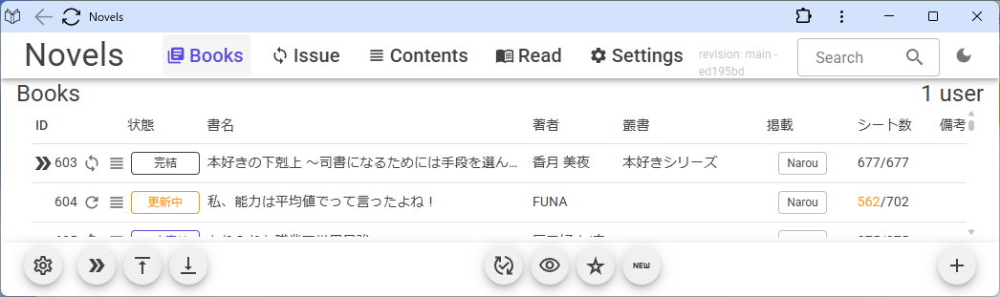

---
title: Web小説の取得と発行
tags: epub webscraping smtp-mail blazor
---

# Web小説の取得と発行
## はじめに
これは極めて個人的なプロジェクトです。
実装がBlazor Serverになっていて、Blazor WASM+SQLiteのようなスタンドアロンアプリにしなかったのは、個人的な都合です。

### 目的
Web小説を取得し、EPUBを生成して、Kindleパーソナルドキュメント向けに発行(Send To Kindle)します。

#### 経緯
元々、FileMakerとAozora Epub3で実現していたものをBlazorで置き換えました。

### 環境
#### ビルド
- .NET 8.0
  - Microsoft.AspNetCore.Authentication.Google 8.0.18
  - Microsoft.AspNetCore.Authorization 8.0.18
- MudBlazor 8.10.0
- PetaPoco 6.0.683
- MySqlConnector 2.4.0
- [AngleSharp](https://github.com/AngleSharp/AngleSharp) 1.3.0
  - The ultimate angle brackets parser library parsing HTML5, MathML, SVG and CSS to construct a DOM based on the official W3C specifications.
- [MailKit](https://github.com/jstedfast/MailKit) 4.13.0
  - A cross-platform .NET library for IMAP, POP3, and SMTP.
- [QuickEPUB](https://github.com/tetr4lab/QuickEPUB/tree/feature/spine-page-progression)
  - Feat: Implement page-progression-direction attribute for spine. Users can now define the reading direction (LTR or RTL) within the spine element of the EPUB.
- [Tetr4labNugetPackages](https://github.com/tetr4lab/Tetr4labNugetPackages)

#### サーバ

https://zenn.dev/tetr4lab/articles/ad947ade600764

https://zenn.dev/tetr4lab/articles/3fb1d4e8e7ff21

#### その他
##### メールサーバ
さくらインターネット (TLS, SMTP認証)

##### ブラウザ
Google Chrome

##### 認証

https://zenn.dev/tetr4lab/articles/1946ec08aec508

https://github.com/tetr4lab/BlazorGoogleOAuthMinimal

###### 認証を除去するには
- `Novels/Novels/Components/Pages/AccessDenied.razor`
  - 削除
- `Novels/Novels/Components/Layout/MainLayout.razor`
  - `<AuthorizeView~>`、`<Authorized>`と`</AuthorizeView>`、`</Authorized>`を削除 (コンテンツは残す)
  - `<NotAuthorized>`~`</NotAuthorized>`を削除
- `Novels/Novels/Components/Routes.razor`
  - `<AuthorizeRouteView>`を`<RouteView>`に変更
- `Novels/Novels/Components/_Imports.razor`
  - 以下を削除
    ```csharp:Novels/Novels/Components/_Imports.razor
    @using Microsoft.AspNetCore.Authentication
    @using Microsoft.AspNetCore.Authentication.Cookies
    @using Microsoft.AspNetCore.Authorization
    @using Microsoft.AspNetCore.Components.Authorization
    @attribute [Authorize (Policy = "Users")]
    ```
- `Novels/Novels/Program.cs`
  - 以下を削除
    ```csharp:Novels/Novels/Program.cs
    // クッキーとグーグルの認証を構成
    builder.Services.AddAuthentication (
        builder.Configuration ["Authentication:Google:ClientId"]!,
        builder.Configuration ["Authentication:Google:ClientSecret"]!
    );

    // メールアドレスを保持するクレームを要求する認可用のポリシーを構成
    await builder.Services.AddAuthorizationAsync (
        $"database=accounts;{builder.Configuration.GetConnectionString ("Host")}{builder.Configuration.GetConnectionString ("Account")}Allow User Variables=true;",
        new () {
            { "Admin", "Administrator" },
            { "Users", "Private" },
        }
    );
    ```

## できること
- Web小説の取得・更新 (なろう、ノクターン、カクヨム、ノベルアップ他)
- 小説内容の確認、各種メモ、文字校正
- EPUBの生成、取得
- Kindleパーソナルドキュメント向け送信

## データ構造
### 論理構成
- 書誌
  - 書誌と目次
- シート
  - 発表単位の本文
- 設定
  - 取得設定、発行設定

### テーブルスキーマ

<details><summary>sql</summary>

```sql:MariaDB
/*!40101 SET @OLD_CHARACTER_SET_CLIENT=@@CHARACTER_SET_CLIENT */;
/*!40101 SET @OLD_CHARACTER_SET_RESULTS=@@CHARACTER_SET_RESULTS */;
/*!40101 SET @OLD_COLLATION_CONNECTION=@@COLLATION_CONNECTION */;
/*!40101 SET NAMES utf8mb4 */;
/*!40103 SET @OLD_TIME_ZONE=@@TIME_ZONE */;
/*!40103 SET TIME_ZONE='+00:00' */;
/*!40014 SET @OLD_UNIQUE_CHECKS=@@UNIQUE_CHECKS, UNIQUE_CHECKS=0 */;
/*!40014 SET @OLD_FOREIGN_KEY_CHECKS=@@FOREIGN_KEY_CHECKS, FOREIGN_KEY_CHECKS=0 */;
/*!40101 SET @OLD_SQL_MODE=@@SQL_MODE, SQL_MODE='NO_AUTO_VALUE_ON_ZERO' */;
/*!40111 SET @OLD_SQL_NOTES=@@SQL_NOTES, SQL_NOTES=0 */;

--
-- Table structure for table `books`
--

DROP TABLE IF EXISTS `books`;
/*!40101 SET @saved_cs_client     = @@character_set_client */;
/*!40101 SET character_set_client = utf8 */;
CREATE TABLE `books` (
  `id` bigint(20) NOT NULL AUTO_INCREMENT,
  `version` int(11) NOT NULL DEFAULT 0,
  `created` datetime NOT NULL DEFAULT current_timestamp(),
  `creator` varchar(50) NOT NULL DEFAULT '',
  `modified` datetime NOT NULL DEFAULT current_timestamp() ON UPDATE current_timestamp(),
  `modifier` varchar(50) NOT NULL DEFAULT '',
  `url1` varchar(255) NOT NULL DEFAULT '',
  `url2` varchar(255) NOT NULL DEFAULT '',
  `html` longtext DEFAULT NULL,
  `site` int(11) NOT NULL DEFAULT 0,
  `title` varchar(255) DEFAULT NULL,
  `author` varchar(255) DEFAULT NULL,
  `number_of_published` int(20) DEFAULT NULL,
  `published_at` datetime DEFAULT NULL,
  `read` bit(1) NOT NULL DEFAULT b'0',
  `memorandum` varchar(255) DEFAULT NULL,
  `status` varchar(50) NOT NULL DEFAULT '',
  `html_backup` longtext DEFAULT NULL,
  `errata` longtext DEFAULT NULL,
  `wish` bit(1) NOT NULL DEFAULT b'0',
  `bookmark` bigint(20) DEFAULT NULL,
  `remarks` varchar(255) DEFAULT NULL,
  PRIMARY KEY (`id`) USING BTREE
) ENGINE=InnoDB DEFAULT CHARSET=utf8mb4 COLLATE=utf8mb4_bin;
/*!40101 SET character_set_client = @saved_cs_client */;
/*!50003 SET @saved_cs_client      = @@character_set_client */ ;
/*!50003 SET @saved_cs_results     = @@character_set_results */ ;
/*!50003 SET @saved_col_connection = @@collation_connection */ ;
/*!50003 SET character_set_client  = utf8mb4 */ ;
/*!50003 SET character_set_results = utf8mb4 */ ;
/*!50003 SET collation_connection  = utf8mb4_general_ci */ ;
/*!50003 SET @saved_sql_mode       = @@sql_mode */ ;
/*!50003 SET sql_mode              = 'STRICT_TRANS_TABLES,ERROR_FOR_DIVISION_BY_ZERO,NO_AUTO_CREATE_USER,NO_ENGINE_SUBSTITUTION' */ ;
DELIMITER ;;
/*!50003 CREATE*/ /*!50003 TRIGGER `version_check_before_update_on_books` BEFORE UPDATE ON `books` FOR EACH ROW begin
    if new.version <= old.version then
        signal SQLSTATE '45000'
        set MESSAGE_TEXT = 'Version mismatch detected.';
    end if;
END */;;
DELIMITER ;
/*!50003 SET sql_mode              = @saved_sql_mode */ ;
/*!50003 SET character_set_client  = @saved_cs_client */ ;
/*!50003 SET character_set_results = @saved_cs_results */ ;
/*!50003 SET collation_connection  = @saved_col_connection */ ;

--
-- Table structure for table `settings`
--

DROP TABLE IF EXISTS `settings`;
/*!40101 SET @saved_cs_client     = @@character_set_client */;
/*!40101 SET character_set_client = utf8 */;
CREATE TABLE `settings` (
  `id` bigint(20) NOT NULL AUTO_INCREMENT,
  `version` int(11) NOT NULL DEFAULT 0,
  `created` datetime NOT NULL DEFAULT current_timestamp(),
  `creator` varchar(50) NOT NULL DEFAULT '',
  `modified` datetime NOT NULL DEFAULT current_timestamp() ON UPDATE current_timestamp(),
  `modifier` varchar(50) NOT NULL DEFAULT '',
  `personal_document_limit_size` int(11) NOT NULL DEFAULT 0,
  `smtp_mailaddress` varchar(255) NOT NULL DEFAULT '',
  `smtp_server` varchar(255) NOT NULL DEFAULT '',
  `smtp_port` int(11) NOT NULL DEFAULT 25,
  `smtp_username` varchar(255) NOT NULL DEFAULT '',
  `smtp_password` varchar(255) NOT NULL DEFAULT '',
  `smtp_mailto` varchar(255) NOT NULL DEFAULT '',
  `smtp_cc` varchar(255) NOT NULL DEFAULT '',
  `smtp_bcc` varchar(255) NOT NULL DEFAULT '',
  `smtp_subject` varchar(255) NOT NULL DEFAULT '',
  `smtp_body` varchar(255) NOT NULL DEFAULT '',
  `user_agent` VARCHAR(255) NOT NULL DEFAULT 'Mozilla/5.0 (Windows NT 6.3; Trident/7.0; rv:11.0) like Gecko',
  `access_interval_time` INT(11) NOT NULL DEFAULT 1000,
  `default_cookies` LONGTEXT NOT NULL DEFAULT '{ "over18": "yes" }',
  `include_image` bit(1) NOT NULL DEFAULT b'0',
  `remarks` varchar(255) DEFAULT NULL,
  PRIMARY KEY (`id`)
) ENGINE=InnoDB DEFAULT CHARSET=utf8mb4 COLLATE=utf8mb4_bin;
/*!40101 SET character_set_client = @saved_cs_client */;
/*!50003 SET @saved_cs_client      = @@character_set_client */ ;
/*!50003 SET @saved_cs_results     = @@character_set_results */ ;
/*!50003 SET @saved_col_connection = @@collation_connection */ ;
/*!50003 SET character_set_client  = utf8mb4 */ ;
/*!50003 SET character_set_results = utf8mb4 */ ;
/*!50003 SET collation_connection  = utf8mb4_general_ci */ ;
/*!50003 SET @saved_sql_mode       = @@sql_mode */ ;
/*!50003 SET sql_mode              = 'STRICT_TRANS_TABLES,ERROR_FOR_DIVISION_BY_ZERO,NO_AUTO_CREATE_USER,NO_ENGINE_SUBSTITUTION' */ ;
DELIMITER ;;
/*!50003 CREATE*/ /*!50003 TRIGGER `version_check_before_update_on_settings` BEFORE UPDATE ON `settings` FOR EACH ROW begin
    if new.version <= old.version then
        signal SQLSTATE '45000'
        set MESSAGE_TEXT = 'Version mismatch detected.';
    end if;
END */;;
DELIMITER ;
/*!50003 SET sql_mode              = @saved_sql_mode */ ;
/*!50003 SET character_set_client  = @saved_cs_client */ ;
/*!50003 SET character_set_results = @saved_cs_results */ ;
/*!50003 SET collation_connection  = @saved_col_connection */ ;

--
-- Table structure for table `sheets`
--

DROP TABLE IF EXISTS `sheets`;
/*!40101 SET @saved_cs_client     = @@character_set_client */;
/*!40101 SET character_set_client = utf8 */;
CREATE TABLE `sheets` (
  `id` bigint(20) NOT NULL AUTO_INCREMENT,
  `version` int(11) NOT NULL DEFAULT 0,
  `created` datetime NOT NULL DEFAULT current_timestamp(),
  `creator` varchar(50) NOT NULL DEFAULT '',
  `modified` datetime NOT NULL DEFAULT current_timestamp() ON UPDATE current_timestamp(),
  `modifier` varchar(50) NOT NULL DEFAULT '',
  `book_id` bigint(20) NOT NULL,
  `url` varchar(255) NOT NULL DEFAULT '',
  `html` longtext DEFAULT NULL,
  `sheet_update` datetime DEFAULT NULL,
  `novel_no` INT(20) NOT NULL DEFAULT 0,
  `errata` longtext DEFAULT NULL,
  `remarks` varchar(255) DEFAULT NULL,
  PRIMARY KEY (`id`) USING BTREE,
  CONSTRAINT `fk_bookid_books_id` FOREIGN KEY (`book_id`) REFERENCES `books` (`id`) ON UPDATE RESTRICT ON DELETE CASCADE
) ENGINE=InnoDB DEFAULT CHARSET=utf8mb4 COLLATE=utf8mb4_bin;
/*!40101 SET character_set_client = @saved_cs_client */;
/*!50003 SET @saved_cs_client      = @@character_set_client */ ;
/*!50003 SET @saved_cs_results     = @@character_set_results */ ;
/*!50003 SET @saved_col_connection = @@collation_connection */ ;
/*!50003 SET character_set_client  = utf8mb4 */ ;
/*!50003 SET character_set_results = utf8mb4 */ ;
/*!50003 SET collation_connection  = utf8mb4_general_ci */ ;
/*!50003 SET @saved_sql_mode       = @@sql_mode */ ;
/*!50003 SET sql_mode              = 'STRICT_TRANS_TABLES,ERROR_FOR_DIVISION_BY_ZERO,NO_AUTO_CREATE_USER,NO_ENGINE_SUBSTITUTION' */ ;
DELIMITER ;;
/*!50003 CREATE*/ /*!50003 TRIGGER `version_check_before_update_on_sheets` BEFORE UPDATE ON `sheets` FOR EACH ROW begin
    if new.version <= old.version then
        signal SQLSTATE '45000'
        set MESSAGE_TEXT = 'Version mismatch detected.';
    end if;
END */;;
DELIMITER ;
/*!50003 SET sql_mode              = @saved_sql_mode */ ;
/*!50003 SET character_set_client  = @saved_cs_client */ ;
/*!50003 SET character_set_results = @saved_cs_results */ ;
/*!50003 SET collation_connection  = @saved_col_connection */ ;
/*!40103 SET TIME_ZONE=@OLD_TIME_ZONE */;

/*!40101 SET SQL_MODE=@OLD_SQL_MODE */;
/*!40014 SET FOREIGN_KEY_CHECKS=@OLD_FOREIGN_KEY_CHECKS */;
/*!40014 SET UNIQUE_CHECKS=@OLD_UNIQUE_CHECKS */;
/*!40101 SET CHARACTER_SET_CLIENT=@OLD_CHARACTER_SET_CLIENT */;
/*!40101 SET CHARACTER_SET_RESULTS=@OLD_CHARACTER_SET_RESULTS */;
/*!40101 SET COLLATION_CONNECTION=@OLD_COLLATION_CONNECTION */;
/*!40111 SET SQL_NOTES=@OLD_SQL_NOTES */;
```

</details>

## 画面と機能
当初、複数ページで作成したものをSPA化したので、名残があります。



### 構成
- 共通: 上部ナビゲーションバー
  - ページ切り替え、検索、テーマ切り替え
- ページ
  - Books(ホーム)
    - 書誌一覧、新規作成
  - Issue
    - 書誌編集、校正、取得・更新、発行、削除
  - Contents
    - シート一覧
  - Read
    - シート閲覧、校正
  - Settings
    - 設定

## おわりに
お読みいただきありがとうございました。
